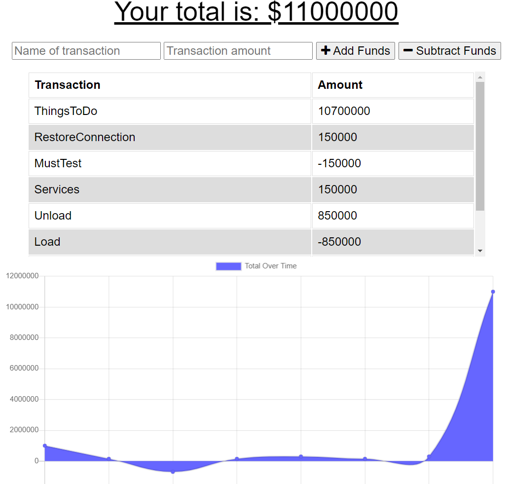

# transaction-store

# 

Load/store financial transactions while offline or connected in the cloud.

 

## Table of Contents

- [transaction-store](#transaction-store)
- [Description](#description)
- [Installation](#installation)
- [Usage](#usage)
- [Licence](#licence)
- [Contributing](#contributing)
- [Questions](#questions)

## Description



MongoDB cloud-based financial transaction log with summary charting and offline capability.

[Deployed Heroku Instance](https://quiet-coast-03759.herokuapp.com/)
[GitHub Repo](https://www.github.com/brhestir/transaction-store)

## Installation

```bash
npm install
```

## Usage

```bash
npm start
```

## Licence


## Contributing

Clone this repo and create a pull request.

## Questions

Questions/comments/suggestions welcome.
